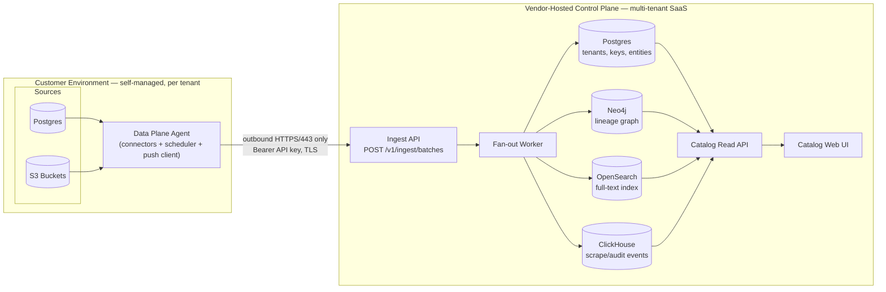
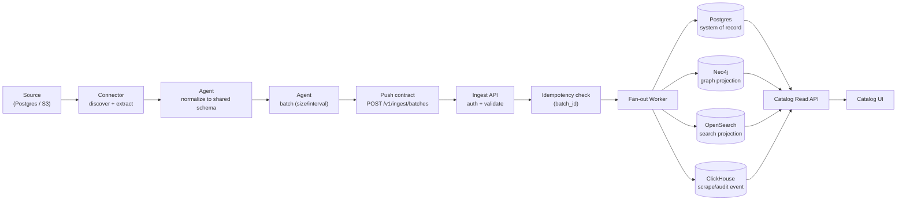
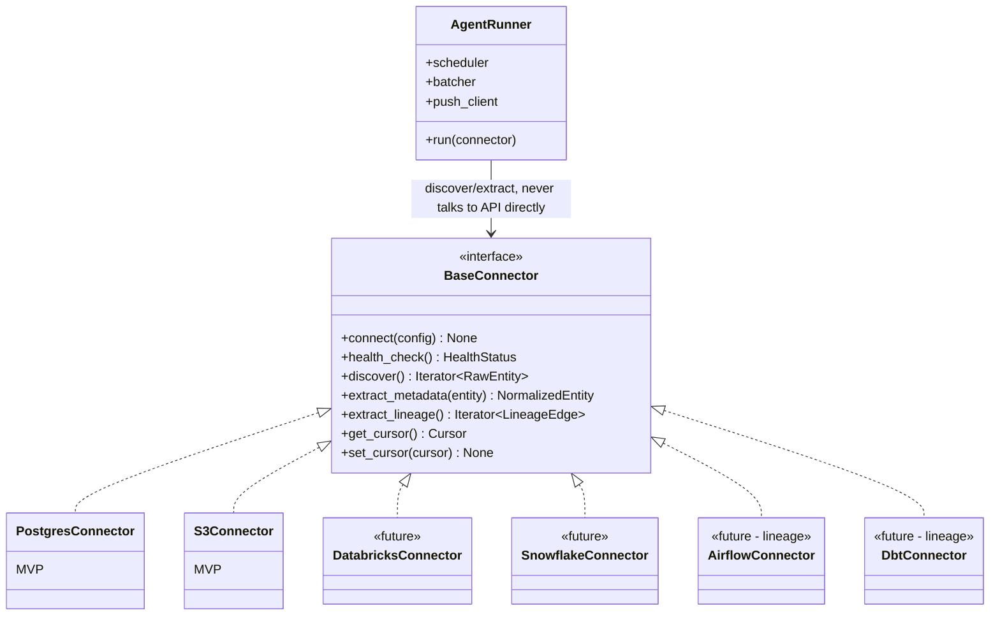

# Architecture

Status: v1 — owned by Tech Lead. Fixed constraints from `decisions.md`:
control-plane/data-plane split, outbound-only push, connector extensibility,
airgapped-later, MVP = Postgres + S3 connectors. This document is the
contract every engineer builds against; changes to the push contract or
connector interface after engineering starts must be logged as a new entry
in `decisions.md`, not silently edited here.

---

## 1. Repo layout

Single monorepo (this repo), not separate repos, with a hard boundary
enforced by directory + dependency direction rather than by repo split:

```
data-discovery-metadata-engine/
├── data-plane/                      # ships INTO customer environments
│   ├── connectors/
│   │   ├── core/                    # BaseConnector interface, entity/lineage
│   │   │                            # normalization types, cursor contract
│   │   ├── postgres/                # MVP
│   │   └── s3/                      # MVP
│   ├── agent/                       # scheduler, batcher, push client,
│   │                                # retry/backoff, local dead-letter queue,
│   │                                # config (control-plane URL is a config
│   │                                # value, never hardcoded — required for
│   │                                # airgapped-later)
│   └── deploy/                      # Dockerfile, Helm chart / k8s manifests,
│                                     # docker-compose for local dev
├── control-plane/                   # vendor-hosted (or airgapped self-host)
│   ├── api/
│   │   ├── ingest/                  # push contract endpoint (data plane → here)
│   │   └── catalog/                 # read API the UI consumes
│   ├── workers/
│   │   └── fanout/                  # validated batch → Postgres/Neo4j/
│   │                                # OpenSearch/ClickHouse
│   ├── storage/
│   │   ├── relational/              # Postgres: tenants, API keys, connector
│   │   │                            # registry, entity system-of-record
│   │   ├── graph/                   # Neo4j client, node/edge schema, Cypher
│   │   ├── search/                  # OpenSearch client, index mappings
│   │   │   └── relevance/           # ranking/boost profile (ML engineer)
│   │   └── analytics/               # ClickHouse client, table schema
│   └── web/                         # catalog UI
├── shared/
│   └── schema/                      # canonical entity + push-contract
│                                     # schemas (JSON Schema), versioned.
│                                     # The ONLY package both planes depend on.
├── infra/                           # docker-compose (local), IaC
└── .claude/team/                    # planning docs (this file, decisions, etc.)
```

**Why monorepo, with this split (not separate repos, not one flat app):**

- The data plane and control plane are **independently deployable** (one
  runs in the customer's cluster, one runs on the vendor's infra), so they
  must never share runtime state or import each other's internals. That
  boundary is what actually matters, and it's enforced by dependency
  direction (`data-plane/` and `control-plane/` each depend on
  `shared/schema/`, never on each other) — a monorepo doesn't weaken this if
  the rule is followed.
- They **do** share one thing that must never drift: the metadata schema and
  push-contract envelope. Putting `shared/schema/` in the same repo means a
  contract change is one atomic commit reviewed by both sides, instead of a
  cross-repo version-bump dance — valuable at current team size/velocity
  (single Tech Lead, 5 engineers, MVP timeline).
- Separate repos become worth it once the data plane has its own release
  cadence (customers pin agent versions independently of control-plane
  deploys). Nothing above blocks that split later — `data-plane/` is already
  self-contained and only depends on the versioned `shared/schema/` package,
  so it could be extracted with its git history via `git subtree split`
  without a redesign.
- `shared/schema/` (not `shared/connector-sdk`) is deliberately the *only*
  shared package. The connector interface itself (`data-plane/connectors/core`)
  stays inside `data-plane/` — the control plane has no reason to import it,
  and keeping it there prevents the control plane from accidentally coupling
  to connector internals.

---

## 2. The metadata push contract

This is the most load-bearing interface in the system. FE1 (control-plane
ingest) and the Data Engineer (data-plane agent) both build directly against
this section — treat it as frozen; propose changes via `decisions.md`, don't
edit silently.

### Transport

- **Plain HTTPS/JSON over port 443**, not gRPC/websocket. Reasoning is in
  §5 (outbound-only) — the short version: it has to survive corporate
  egress proxies with zero customer-side allowlisting beyond "HTTPS out is
  allowed," which is already true almost everywhere.
- Endpoint: `POST https://{control-plane-host}/v1/ingest/batches`
  (`control-plane-host` is a config value in the data-plane agent, never
  hardcoded — required for airgapped-later).

### Auth

- Each data-plane installation registers against the control plane once
  (during setup) and receives a **long-lived, revocable API key**, scoped to
  exactly one `(tenant_id, data_plane_id)` pair.
- Sent as `Authorization: Bearer <key>` on every request.
- **`tenant_id` is never accepted from the request body** — the ingest API
  resolves it server-side from the API key. This closes the obvious
  cross-tenant spoofing hole even though MVP has one tenant (see §6).
- Future-friendly, not built now: short-lived OAuth2 client-credentials
  tokens / mTLS, for customers who want key rotation without redeploying the
  agent. The envelope shape below doesn't change either way.

### Request envelope

```json
{
  "batch_id": "b7e2b6b0-...-uuid",
  "data_plane_id": "dp_9f3...",
  "connector_type": "postgres",
  "schema_version": "1.0",
  "sent_at": "2026-09-02T10:15:00Z",
  "entities": [
    {
      "urn": "urn:postgres:prod-db-1:analytics:public.orders",
      "entity_type": "table",
      "operation": "upsert",
      "content_hash": "sha256:...",
      "extracted_at": "2026-09-02T10:14:50Z",
      "payload": { "...": "entity-type-specific fields, see shared/schema" }
    }
  ]
}
```

- `urn` is the stable identity of an entity across pushes — deterministic,
  built from connector type + source coordinates (e.g.
  `urn:postgres:{host}:{database}:{schema}.{table}`,
  `urn:s3:{bucket}/{key_prefix}`). Column/job/lineage-edge URNs are
  namespaced under their parent. Exact per-entity-type field lists are
  owned by the BA in `spec.md`'s metadata schema section and land in
  `shared/schema/*.schema.json`; this document defines the transport
  envelope, not the final field list.
- `entity_type` ∈ `{table, column, job, dashboard, lineage_edge, ...}` —
  extensible; new types don't require an envelope change, only a new schema
  file under `shared/schema/`.
- `operation` ∈ `{upsert, delete}` — connectors emit `delete` when discovery
  no longer finds a previously-seen entity (dropped table, deleted object).

### Batching

- The agent (not each connector) owns batching: accumulate normalized
  entities and flush on **whichever comes first** — `max_batch_entities`
  (default 500) or `max_batch_interval` (default 60s), configurable per
  install. Keeps request size predictable and bounds worst-case staleness.

### Idempotency

- `batch_id` is a client-generated UUID, unique per attempt-set (a retry of
  the *same* batch reuses the *same* `batch_id`).
- The ingest API checks `batch_id` against a short-TTL idempotency store
  (Postgres table, TTL a few days) before processing. A replayed `batch_id`
  returns the cached response with no re-processing — safe to retry blindly.
- Independent of that, each entity is upserted by `urn` (not by batch), so
  even a non-idempotent replay would just re-write the same state — idempotency
  is defense in depth, not the only thing preventing duplication.
- `content_hash` lets the fan-out worker skip re-writing to Neo4j/OpenSearch
  when a re-scrape found no actual change — cheap no-op detection.

### Response / retry

- Response is **per-entity**, not just a batch-level status code, because a
  batch may be partially valid:

```json
{
  "batch_id": "b7e2b6b0-...",
  "accepted": ["urn:postgres:...orders"],
  "rejected": [
    { "urn": "urn:postgres:...bad_table", "error": "schema_validation_failed", "detail": "..." }
  ]
}
```

- `200`/`202` with this body = the API processed the batch (even if some
  entities were rejected for being malformed — that's a data-quality bug in
  the connector, not a transport failure, and DE owns fixing it, not retrying
  it blindly).
- `5xx` / timeout / connection failure = transport failure. The agent
  retries the **whole batch** with exponential backoff + jitter (base 5s,
  cap ~5min, e.g. 6 attempts over ~15 min). After exhausting retries, the
  batch is written to a local on-disk dead-letter queue and retried on the
  agent's next scheduled cycle — because the data plane can't get anything
  inbound from the control plane, it must be able to survive the control
  plane being unreachable for extended periods without losing scraped
  metadata.
- Validation happens **before** the idempotency/fan-out step, and rejects
  return `400` with the same per-entity error shape if the *entire* batch is
  malformed (e.g. bad auth already handled at `401`, malformed JSON at
  `400` batch-level).

---

## 3. Connector interface

Language: **Python** for the whole data plane. Justification: every
MVP-and-near-term source has first-class Python tooling the agent needs to
call directly rather than shell out to — `psycopg`/`psycopg2` (Postgres),
`boto3` (S3), and critically for the connectors coming right after MVP,
`dbt-core`'s manifest/catalog artifacts and the `apache-airflow-client` are
both Python-native. Pick one language the whole roadmap benefits from rather
than optimizing per-connector.

```python
class BaseConnector(ABC):
    def connect(self, config: dict) -> None: ...        # raises on bad creds/connectivity
    def health_check(self) -> HealthStatus: ...

    def discover(self) -> Iterator[RawEntity]: ...       # enumerate what exists
    def extract_metadata(self, entity: RawEntity) -> NormalizedEntity: ...
    def extract_lineage(self) -> Iterator[LineageEdge]: ...  # default: empty: not all sources have lineage

    def get_cursor(self) -> Cursor: ...                  # for incremental scrape
    def set_cursor(self, cursor: Cursor) -> None: ...
```

- `NormalizedEntity` / `LineageEdge` are the in-process Python types that
  serialize directly into the push-contract `entities[]` payload shape
  (§2) — the connector never talks to the ingest API itself.
- The **agent runner** (`data-plane/agent/`) is the only thing that knows
  about scheduling, batching, the push client, retries, and the dead-letter
  queue. It drives any `BaseConnector` the same way:
  `discover → extract_metadata (+ extract_lineage) → hand to batcher`.
  This is what makes new connectors pluggable without touching the
  data-plane core: **a new source = a new class implementing
  `BaseConnector`, registered in agent config — zero changes to
  `data-plane/agent/`.**
- MVP implementations:
  - `PostgresConnector` — `discover()` walks `information_schema`
    (schemas → tables → columns), `get_cursor()`/`set_cursor()` track
    per-table `last_scraped_at` for incremental re-scrape rather than
    re-introspecting everything every cycle. `extract_lineage()` returns
    empty for MVP (Postgres has no native lineage source — dbt/Airflow will
    supply lineage edges later that reference Postgres table URNs).
  - `S3Connector` — `discover()` walks configured bucket/prefixes,
    `extract_metadata()` captures object/key-prefix "dataset" shape
    (partitioning inferred from key structure), size, last-modified. No
    lineage.
- **Post-MVP plug-in path (no data-plane core changes required):**
  - `DatabricksConnector` / `SnowflakeConnector` — same shape as Postgres,
    swap the introspection query layer (`information_schema` equivalents).
  - `AirflowConnector` — `discover()` over DAGs/tasks,
    `extract_lineage()` emits `job → dataset` edges from task
    input/output inlets, or by parsing DAG-level lineage metadata if the
    customer's Airflow emits OpenLineage events.
  - `DbtConnector` — reads `manifest.json`/`catalog.json` artifacts,
    `extract_lineage()` emits `model → model` and `model → source` edges
    directly from dbt's dependency graph — this is close to a direct
    `LineageEdge` mapping, minimal transform needed.
  - All four only add a new directory under `data-plane/connectors/` and a
    config entry. This is the concrete test the interface was designed
    against.

---

## 4. Control-plane storage model

Four engines, one per workload — not one database asked to do everything:

| Workload | Engine | Role |
|---|---|---|
| Tenant/API-key/connector registry, **entity system of record** | **Postgres** | transactional, ACID, source of truth |
| Lineage & entity relationships | **Neo4j** (5.x) | graph projection, multi-hop traversal |
| Full-text/keyword catalog search | **OpenSearch** | search projection |
| Scrape history, usage/access events, audit/freshness trail | **ClickHouse** | append-only analytics |

**Postgres holds the entities themselves and is the source of truth.**
Neo4j and OpenSearch are *derived, read-optimized projections* of that data
(rebuildable from Postgres if either needs to be reindexed or migrated) —
this avoids making a graph database the sole custodian of data that also
needs simple transactional CRUD, backup, and point-in-time query, which
graph engines aren't optimized for. ClickHouse is not a projection of
anything — the fan-out worker writes scrape/audit events to it directly, and
it doesn't participate in entity storage at all, since it's a fundamentally
different shape of data (immutable event stream vs. mutable entity state).

### Graph: Neo4j

**Decision: Neo4j 5.x**, either self-hosted (Docker/Helm, same as every
other control-plane component) or AuraDB managed — same product either way,
which matters directly for airgapped-later: a customer self-hosting the
whole control plane runs the identical Neo4j image the vendor runs, no
managed-service-only feature gets load-bearing. This rules out AWS Neptune
(cloud-vendor-locked, breaks self-host/airgapped) as a concrete alternative
considered and rejected.

Model: `(:Table)`, `(:Column)`, `(:Job)`, `(:Dashboard)` nodes;
`[:HAS_COLUMN]`, `[:PRODUCES]`, `[:CONSUMES]`, `[:DERIVES_FROM]`,
`[:OWNED_BY]` edges. Every node/edge carries a `tenant_id` property (§6).

Justified against the UI's actual query patterns:
- **Impact analysis** ("what breaks if I change this table") is a
  variable-length outbound traversal:
  `MATCH (t:Table {urn:$urn})<-[:DERIVES_FROM*1..10]-(downstream) RETURN downstream`
  — this is a native Cypher primitive with predictable cost via the
  relationship index; the equivalent in pure SQL is a recursive CTE per hop
  that degrades badly past 3-4 hops and gets worse with fan-out width,
  exactly the shape lineage graphs have (one job feeding many tables feeding
  many dashboards).
- **"What feeds this table"** (upstream) is the mirror traversal,
  `-[:DERIVES_FROM*1..N]->`, equally native.
- Column-level lineage (a stretch goal beyond MVP) is the same pattern one
  level down — `(:Column)-[:DERIVES_FROM]->(:Column)` — with no schema
  change, whereas a relational lineage table would need a second
  parallel edge table and app-level recursive-join logic to support both
  granularities.

### Search: OpenSearch

Apache-2.0 licensed (not the Elastic license — matters for airgapped
self-host, no license-server dependency), Elasticsearch-API-compatible,
mature full-text ranking (BM25), and supports the same self-host/managed
duality as Neo4j. Indexes table/column/dashboard `name`, `description`,
`tags`, `owner`, denormalized from Postgres by the fan-out worker.
`storage/search/relevance/` (ML engineer, see §8) owns ranking/boost
configuration on top of the base index FE2 builds.

### Analytics: ClickHouse

Already available in the owner's environment. Table shape:
`scrape_events(tenant_id, data_plane_id, connector_type, urn, event_type, occurred_at, detail)`
and `usage_events(tenant_id, urn, actor, action, occurred_at)`, both
`ORDER BY (tenant_id, occurred_at)` and partitioned by month. This is
append-only, high-cardinality-over-time data (every scrape cycle, every UI
view) that would bloat Postgres and has no graph shape — ClickHouse's
columnar storage and time-bucketed aggregation is the correct fit, and
explicitly the wrong fit for Neo4j (events aren't graph-shaped) or Postgres
(would degrade OLTP query performance on the entity tables under high
write volume).

---

## 5. Outbound-only, concretely

**Decision: scheduled outbound HTTPS batch push** (§2's transport), not a
long-lived streaming connection (gRPC stream / websocket).

The data-plane agent runs on a schedule (in-process scheduler or k8s
CronJob, configurable interval), performs discovery + extraction, batches,
and issues a plain `POST` over outbound HTTPS/443. Each request is
independent — connect, send, get a response, close. Nothing ever listens
for inbound connections in the customer's environment, and nothing about
this protocol requires the customer to configure anything beyond "outbound
HTTPS to one host is allowed," which is close to universally already true.

**Why not a long-lived connection**, considered and rejected for MVP:
- A persistent websocket/gRPC stream still satisfies "customer opens no
  inbound port" (the data plane still dials out), so it isn't disqualified
  by the firewall constraint alone — but it fails on operational grounds:
  many corporate egress proxies throttle, buffer, or outright kill
  long-idle outbound connections or block the HTTP upgrade a websocket
  needs, which turns "just allow outbound HTTPS" into "please also
  allowlist this specific long-lived-connection behavior with our
  network team" — a materially worse install story than a plain POST.
- The control plane would need to hold open and manage connection state for
  every tenant's agent concurrently (heartbeats, reconnect logic,
  backpressure) — real complexity with no payoff, because catalog metadata
  has no sub-second freshness requirement (a table's schema doesn't need to
  appear in the catalog within milliseconds of changing; the BA's NFR
  section will pin the exact freshness target, but "scheduled, on the order
  of minutes" is the right ballpark for a catalog, unlike e.g. live
  monitoring).
- Stateless request/response also makes the idempotency/retry model in §2
  simple and testable — each batch is a self-contained, replayable unit. A
  stream blurs that boundary (where does a "batch" end if the connection is
  never closed?).

**Forward-compatible for control-plane-initiated actions** (e.g. a future
"trigger scrape now" button in the UI): still outbound-only — the agent
additionally *polls* a `GET /v1/commands` endpoint on its existing schedule
(or a faster one) and executes anything queued there. This is the same
pattern CI self-hosted runners and most monitoring agents use: the control
plane never dials in, it just leaves something for the agent to pick up
next time it calls out. No architecture change needed when this is built —
just a new outbound call the agent already knows how to make.

---

## 6. Multi-tenancy in the data model (single-tenant MVP)

Every control-plane record is tenant-scoped from day one, even though MVP
provisions exactly one row in `tenants`:

- **Postgres**: every table (`entities`, `api_keys`, `data_plane_registrations`,
  `connector_runs`, …) has a non-nullable `tenant_id` FK, indexed, and every
  query is written with `WHERE tenant_id = :tenant_id` from day one (row-level
  security policies can be layered on later without a schema change once
  there's more than one tenant to isolate).
- **Neo4j**: every node and edge carries a `tenant_id` property; all Cypher
  queries filter on it. If cross-tenant query isolation ever needs to be
  physical rather than logical, Neo4j's multi-database feature can split
  tenants into separate databases later without changing the node/edge
  model, only the connection-routing layer.
- **OpenSearch**: every document carries `tenant_id`; queries apply it as a
  mandatory term filter. Splitting to index-per-tenant later (for very large
  tenants) is an indexing-strategy change, not a document-shape change.
- **ClickHouse**: `tenant_id` is the leading column in every `ORDER BY`/
  partition key, so tenant-scoped queries are already efficient at MVP scale
  and per-tenant table/database separation later is additive.
- **Auth**: `tenant_id` is resolved server-side from the API key (§2), never
  accepted from the client — this is what actually prevents cross-tenant
  writes, not just the presence of the column.

Net effect: going from one tenant to N is a provisioning and
query-scoping-enforcement exercise, not a data-model rewrite.

---

## 7. Diagrams

### 7.1 System / deployment diagram



### 7.2 Data flow diagram



### 7.3 Sequence diagram — one metadata push

```mermaid
sequenceDiagram
    participant SRC as Source (Postgres/S3)
    participant CONN as Connector
    participant AGENT as Data Plane Agent
    participant API as Ingest API
    participant VAL as Validator
    participant IDEM as Idempotency Store
    participant WORK as Fan-out Worker
    participant PG as Postgres
    participant GR as Neo4j
    participant SR as OpenSearch
    participant CH as ClickHouse

    SRC->>CONN: introspect (scheduled scrape)
    CONN->>AGENT: normalized entities (tables, columns, lineage)
    AGENT->>AGENT: batch (max size / max interval)
    AGENT->>API: POST /v1/ingest/batches (Bearer key, batch_id, entities[])
    API->>API: authenticate, resolve tenant_id from key
    API->>VAL: validate batch vs shared/schema
    VAL-->>API: per-entity validation result
    API->>IDEM: check batch_id
    alt batch_id already processed
        IDEM-->>API: cached response
        API-->>AGENT: 200 (replay, no-op)
    else new batch
        API->>WORK: enqueue accepted entities
        API-->>AGENT: 202 Accepted (per-entity accept/reject)
        WORK->>PG: upsert entity (source of truth)
        WORK->>GR: upsert node/edges
        WORK->>SR: index document
        WORK->>CH: append scrape event
        API->>IDEM: record batch_id (TTL)
    end
    Note over AGENT: 5xx/timeout -> retry with backoff+jitter;<br/>exhausted -> local dead-letter queue,<br/>retried next scheduled cycle
```

### 7.4 Component diagram — connector interface



---

## 8. Task breakdown — 3 fullstack engineers, 1 data engineer, 1 ML engineer

Ownership is by directory, matching §1's layout exactly, so parallel
dispatch doesn't collide. Each row's "depends on" is the interface that must
be treated as frozen (this document) or stubbed early (see "seam" notes)
so nobody blocks on someone else's implementation, only on the agreed shape.

| Engineer | Owns (directories) | Builds | Depends on / interfaces with |
|---|---|---|---|
| **FE1** | `control-plane/api/ingest/`, `shared/schema/`, `control-plane/workers/fanout/` (orchestration only, not the storage clients themselves) | Push contract endpoint exactly per §2: auth, batch validation, idempotency store, per-entity accept/reject response, enqueue to fan-out. Owns and publishes the canonical `shared/schema/*.schema.json` files (envelope + per-entity-type schemas, using BA's field list from `spec.md` once available). | **DE** calls this API and must match §2 exactly. **FE2**'s storage-client interfaces (`GraphStore.upsert_entity()`, `SearchIndex.index_entity()`, `AnalyticsStore.record_event()`, `RelationalStore.upsert_entity()`) are the seam the fan-out worker calls — FE1 codes against those method signatures (agreed upfront, stubbed by FE2 on day one) so both can build in parallel without waiting on each other's full implementation. |
| **FE2** | `control-plane/storage/relational/`, `control-plane/storage/graph/`, `control-plane/storage/search/` (base client + index mapping, not `relevance/`), `control-plane/storage/analytics/`, `control-plane/api/catalog/` | Postgres schema/migrations (tenants, api_keys, entities, connector_runs), Neo4j client + node/edge upsert methods, OpenSearch client + index mapping + base query builder, ClickHouse client + event write path. Catalog read API: `GET /v1/catalog/search`, `GET /v1/catalog/tables/{urn}`, `GET /v1/catalog/tables/{urn}/lineage`, `GET /v1/catalog/sources/status`. | Publishes the storage-client method signatures FE1's fan-out worker calls (day-one stub, per above). Publishes the catalog read API shape **FE3** builds the UI against. Leaves a call-out hook in the search query builder for **ML**'s `relevance/` boost profile (additive — baseline keyword search must work with no boost profile present). |
| **FE3** | `control-plane/web/` | Catalog UI: search results page, table detail page (schema/owner/lineage/freshness), source/connector status view — per Designer's `design.md` (IA/wireframes) once available and PO's user stories in `spec.md`. | Consumes **FE2**'s catalog read API only — no direct storage access from the UI layer. Blocked on Designer's IA for screen layout, but can scaffold routing/data-fetching against FE2's API shape in parallel. |
| **Data Engineer** | `data-plane/connectors/core/`, `data-plane/connectors/postgres/`, `data-plane/connectors/s3/`, `data-plane/agent/` | `BaseConnector` interface (§3) plus the agent runner: scheduler, batcher (§2's size/interval flush), push client, retry/backoff, local dead-letter queue, cursor-based incremental scrape. `PostgresConnector` and `S3Connector` implementations, including schema-drift handling (a dropped column/table becomes a `delete` operation, not an error) and pre-push validation so malformed metadata never reaches the push contract. | Calls **FE1**'s ingest API exactly per §2 — do not invent a different envelope. Emits entities conforming to **FE1**'s `shared/schema/` definitions. |
| **ML Engineer** | `control-plane/storage/search/relevance/` | MVP scope is deliberately narrow per this engineer's role (keyword search itself is FE2/FE3's job, not ML's): the ranking/boost profile on top of FE2's base OpenSearch index — field-weight boosting (name > description > tags), and a popularity signal computed from `usage_events` in ClickHouse (FE2's analytics client) blended into result ranking. Also: write up the post-MVP roadmap note (embeddings-based semantic search / similar-table recommendations over `description` fields) as a section in `status.md` — explicitly not built now, since MVP's metadata schema may not yet have populated description fields to embed. | Plugs into **FE2**'s query builder via the hook FE2 exposes — additive, so baseline search ships even if `relevance/` lags. Reads `usage_events` written by **FE1**'s fan-out worker via FE2's ClickHouse client. |

**Collision avoidance, explicit:**
- `control-plane/storage/search/` is split at the subdirectory level:
  FE2 owns everything except `relevance/`, which is ML's alone.
  `control-plane/storage/search/relevance/` is written and reviewed to have zero required
  edits inside FE2's part of the tree
- `control-plane/workers/fanout/` (FE1, orchestration/enqueue logic) is
  distinct from `control-plane/storage/*` (FE2, the actual client
  implementations the orchestration calls) — FE1 never edits files under
  `storage/`.
- No engineer edits `shared/schema/` except FE1; DE and FE2 treat it as a
  versioned dependency (schema changes bump `schema_version` in §2's
  envelope, and are proposed to FE1, not edited in place by consumers).
- `data-plane/` and `control-plane/` are fully disjoint trees — DE never
  touches control-plane code, FE1/FE2/FE3 never touch data-plane code.
